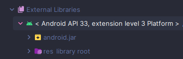

# aosp-android-jar-mirror

A mirror of [Reginer's aosp-android-jar repository](https://github.com/Reginer/aosp-android-jar)

**Note:** android-31.jar appears to have been accidentially removed upstream. I have restored it from the Git history.

## Installation

* Download the JAR file for the SDK level you want to modify.
* Locate your Android SDK directory (this can be done by scrolling down to "External libraries" in an Android Studio
  project, then right-clicking the android.jar file and selecting "Open in" -> "Explorer")

* Replace the existing `android.jar` with the one downloaded from here (make sure to rename to `android.jar`)

## Hashes

| File             | SHA-265                                                            |
|------------------|--------------------------------------------------------------------|
| `android-28.jar` | `7eba0f3c6815e83f6d364431a0c868584632e8cab8386a0b7287a08da0bdf383` | 
| `android-29.jar` | `9dec95a1ac122e71bec7cf09037579fc7f30e924bf24f3582ec46918b0c08476` |
| `android-30.jar` | `6529a1f1eb399a30065600609d599790a97c9e1bfa016edae22fb8701bebca05` |
| `android-31.jar` | `301f606a8447a4b4021b7a65d7ad14414cafa490d846ba9d74f55ac3a705911a` | 
| `android-32.jar` | `4ae31e331ffb4ef117ff358583f0328f92e35882e7c2c67e59178a92a80a1b3f` | 
| `android-33.jar` | `46c79d276c46cb9b32e6567dbe9a9f70c8e236eac0a3e1d8bcf3ff25c16a3805` | 
